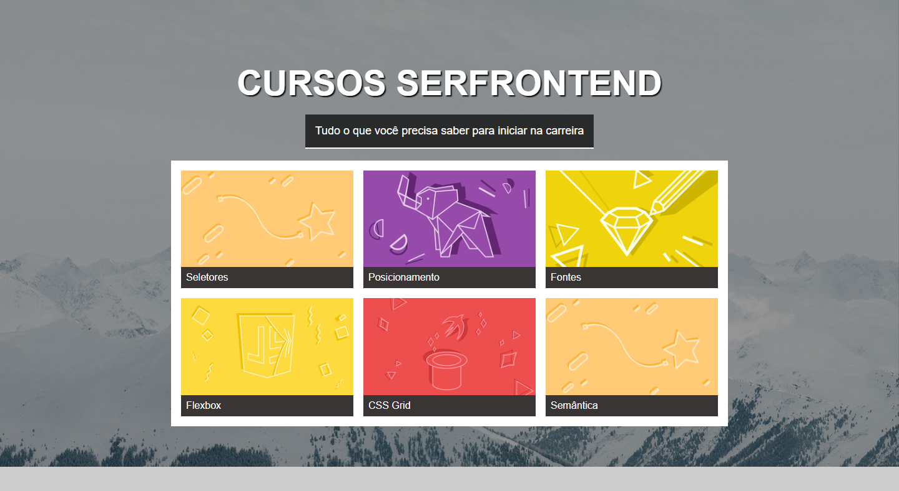

# Projeto Lista de Assinaturas

Esse projeto é minha solução ao segundo desafio apresentado na seção 7 do curso: Curso Web Frontend Fundamentos HTML5 CSS3 e JS + 10 Projetos. Esse desafio teve como foco a prática na utilização do flexbox para o posicionamento de elementos de caixa.

Imagem do resultado obtido.

